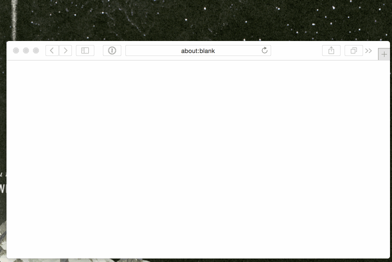

iTunes and App Store Search for Alfred
======================================

> Search the iTunes and App Store with suggestions from [Alfred](http://www.alfredapp.com).

Developed by [Florian Eckerstorfer](https://florian.ec) in Vienna, Europe.

Installation
------------

1. Download [`itunes.alfredworkflow.zip`](https://github.com/florianeckerstorfer/alfred-itunes/releases/latest)
2. Unpack and double-click `itunes.alfredworkflow` to install
3. *(Optional)* Call `itunes_set_affiliate` with Alfred to set your affiliate token (by default my affiliate token is
set)

Usage
-----

### Search for albums in iTunes Store

### Search for artists in iTunes Store

### Search for tracks in iTunes Store

### Search iOS App Store

### Search Mac App Store

